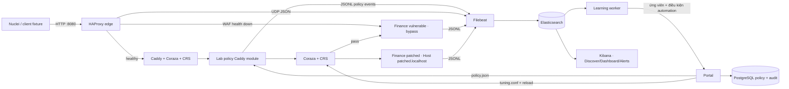

# Cấu trúc repo và luồng mã nguồn

## Sơ đồ

HAProxy luôn ghi ID request và tuyến. WAF policy handler đọc và khôi phục body trong giới hạn 10 MiB, áp dụng geo/rate/anomaly fixture, đặt các header policy nội bộ, rồi gọi Coraza. Coraza kiểm tra CRS; rule lab chuyển engine request sang DetectionOnly khi policy chọn chế độ đó. Ngoại lệ 942100 tại `/api/lab/search` là công tắc fixture cũ; portal `/advanced` còn cho phép tạo ngoại lệ theo Host, rule ID, method, route và target. Request qua CRS mới đến Next.js. Host `direct.localhost` chọn upstream gốc để baseline; failover tự động là backup server ở HAProxy.

## Policy runtime và rule Coraza

Bot detection nằm trong `lab/waf/policy-module/policy.go`. Module Go dùng `github.com/mileusna/useragent` `v1.3.5` để phân loại User-Agent tự khai báo, bộ đếm đường dẫn khác nhau theo IP để nhận diện quét, và `golang.org/x/time/rate` `v0.16.0` để giới hạn request lặp của bot ngay trước Coraza. Portal `/advanced` ghi `bot_detection` vào `lab/runtime/policy/policy.json`; WAF đọc policy mỗi request. Quyết định được ghi vào log `waf.behavior` và Filebeat chuyển tới Elasticsearch/Kibana. User-Agent không xác thực danh tính bot; HAProxy chuyển thẳng tới origin khi WAF down thì bước này cũng bị bỏ qua.

| Thành phần | Vai trò | Cách thay đổi |
| --- | --- | --- |
| `runtime/policy/policy.json` | Giá trị điều khiển: chế độ, PL, bật virtual patch/ngoại lệ, IP/CIDR, geo, rate và hành vi. Module `lab_policy` đọc lại mỗi request. | Đổi trong portal; portal lưu bản chính ở PostgreSQL rồi xuất JSON. |
| `waf/config/lab-rules.conf` | Các `SecRule` tĩnh mà Coraza thực thi: đọc header nội bộ, đặt PL, thêm ngoại lệ fixture và chặn hai route CVE. | Được mount chỉ đọc; sửa source, kiểm tra cấu hình và reload Caddy. |
| `waf/config/coraza.conf` | Giới hạn request body, audit log và debug log của Coraza. | Được mount chỉ đọc; sửa source, kiểm tra cấu hình và reload Caddy. |
| `runtime/tuning/tuning.conf` | Các ngoại lệ CRS có phạm vi hẹp được portal sinh từ policy đã kiểm tra. Coraza nạp trước CRS. | Đổi trong portal `/advanced`; portal reload Caddy, có rollback nếu reload lỗi. |

`lab_policy` xóa mọi header `X-Lab-*` điều khiển do client gửi, sau đó chỉ đặt giá trị được policy cho phép. Vòng `for` trong `policy.go` xóa lần lượt sáu header dành riêng trước khi module đặt lại, để client không thể tự bật ngoại lệ CRS. Các `header_up -X-Lab-*` trong `Caddyfile` loại chúng khỏi request gửi tới ứng dụng sau khi Coraza xử lý. `Caddyfile` giữ thứ tự nạp: cấu hình Coraza đề xuất → CRS setup → cấu hình engine của lab → rule lab → các rule CRS. Rule ngoại lệ phải đứng trước CRS để tác động lên giao dịch hiện tại. `load_owasp_crs` cho phép dùng các tài nguyên CRS nhúng; `tx_id_req_header` dùng request ID do HAProxy ghi đè để nối audit Coraza với log HAProxy và ứng dụng.

Cấu hình `Caddyfile` và `waf/config/` được Compose mount chỉ đọc. Sau khi sửa `SecRule` trên host, chạy `caddy validate` rồi `caddy reload` trong container WAF; chỉ sửa file trên host chưa áp dụng rule mới. `policy.json` được module đọc ở từng request nên các công tắc hiện có trong portal có hiệu lực mà không cần reload. Mã Go của module phải được biên dịch vào Caddy và vẫn cần build lại image khi sửa.

Portal `/advanced` quản lý ngoại lệ theo Host, rule ID, method, đường dẫn và target; hỗ trợ thu hồi, hạn dùng, gắn nhãn ứng viên learning và mode `manual`/`automatic`. Worker nằm ở `lab/learning-worker/`, đọc Elasticsearch rồi gửi dữ liệu qua API nội bộ của portal. Bộ đếm hành vi trong `policy.go` vẫn chỉ là quyết định theo request và độc lập với learning worker. Phiên bản lab chỉ có một site tài chính với hai biến thể origin; các chức năng quản trị nhiều site, MFA và kho lưu request 30 ngày của Plan.md chưa được triển khai.

## Mô tả thư mục và file

### Gốc repo

- `README.md`: điểm bắt đầu và liên kết tới hướng dẫn.
- `docker-compose.yml`: Compose ban đầu. Giữ nguyên; xem tài liệu đề xuất cấu hình.
- `coraza-caddy/`: Caddy/Coraza ban đầu; giữ nguyên. Có thay đổi chưa commit sẵn ở `coraza-caddy/Dockerfile` trước khi triển khai lab, không thuộc thay đổi của lab.
- `ROC/`: công cụ cũ; không dùng trong lượt này.
- `lab/`: toàn bộ stack mới, độc lập với cấu hình gốc.
- `docs/`: hướng dẫn kiến trúc, kịch bản và đề xuất chỉnh cấu hình gốc.

### `lab/`

- `docker-compose.yml`: khai báo service, network nội bộ, cổng loopback, healthcheck và volume riêng.
- `.env.example`: ví dụ biến môi trường cục bộ.
- `README.md`: cài đặt, chạy/dừng/reset, quét Nuclei, Kibana, failover, xử lý lỗi.
- `.gitignore`: giữ lại các `.gitkeep`, bỏ log/kết quả scan được sinh lúc chạy.
- `edge/`: cấu hình HAProxy và các tuyến đầu vào.
- `waf/`: Caddy, Coraza/CRS và module policy riêng của lab.
- `finance/`: ứng dụng Next.js và các fixture dữ liệu giả.
- `portal/`: giao diện policy và API cấu hình WAF.
- `canary/`: máy đích nội bộ chỉ trả marker SSRF giả.
- `observability/`: cấu hình thu thập log.
- `nuclei-templates/`: probe giới hạn trong ứng dụng lab.
- `runtime/logs/`, `runtime/policy/`, `runtime/tuning/`, `runtime/results/`: dữ liệu phát sinh, cấu hình runtime, ngoại lệ CRS và kết quả scan.
- `scripts/`: smoke check trước/sau khi chạy Nuclei.
- `edge/haproxy.cfg`: route host, ID request, healthcheck WAF, upstream dự phòng, log JSON qua UDP và SMTP lab.
- `waf/Dockerfile`: build Caddy 2.11.4 với Coraza-Caddy 2.6.1 (Coraza 3.7.0, CRS 4.25.0 LTS) và module `lab_policy`.
- `waf/Caddyfile`: thứ tự policy → Coraza/CRS → finance upstream; nạp cấu hình Coraza và rule lab từ hai file riêng; lấy transaction ID từ X-Request-ID HAProxy.
- `waf/config/coraza.conf`: giới hạn body/audit/debug của Coraza trong lab.
- `waf/config/lab-rules.conf`: các SecRule cố định cho chế độ, PL, ngoại lệ CRS và virtual patch; được nạp trước CRS.
- `waf/policy-module/go.mod`: module Go và dependency Caddy.
- `waf/policy-module/policy.go`: handler policy runtime, bộ đếm hành vi trong bộ nhớ, IP/CIDR fixture, geo và log sự kiện; xóa header điều khiển do client gửi trước khi đặt giá trị từ policy.
- `finance/Dockerfile`: build hai image từ cùng source với phiên bản Next.js khác nhau; app chỉ nối frontend và log network, không nối PostgreSQL portal.
- `finance/package.json`: Next.js/React/TypeScript dependencies và lệnh build/start.
- `finance/next.config.mjs`: một locale và rewrite canary để kiểm thử CVE.
- `finance/tsconfig.json`, `finance/next-env.d.ts`: cấu hình TypeScript/Next.js.
- `finance/proxy.ts`: middleware/proxy fixture kiểm tra quyền demo.
- `finance/.dockerignore`: loại node_modules, `.next`, log và file môi trường khỏi image build context.
- `finance/app/layout.tsx`, `finance/app/styles.css`: shell và thiết kế chung.
- `finance/app/page.tsx`: landing page ngân hàng giả.
- `finance/app/login/page.tsx`: form login demo.
- `finance/app/dashboard/page.tsx`: số dư và giao dịch seed tĩnh.
- `finance/app/transfer/page.tsx`: chuyển khoản chỉ đổi trạng thái giao diện.
- `finance/app/account/private/page.tsx`: marker fixture middleware bypass.
- `finance/app/lab/page.tsx`: danh sách endpoint lab.
- `finance/app/healthz/route.ts`: endpoint health của ứng dụng.
- `finance/app/api/lab/search/route.ts`: marker SQLi mô phỏng, không kết nối DB.
- `finance/app/api/lab/xss/route.ts`: endpoint phản chiếu HTML có nhãn lab.
- `finance/app/api/lab/documents/[id]/route.ts`: chứng từ giả để minh họa IDOR.
- `finance/app/api/lab/file/route.ts`: marker path traversal ảo, không đọc host file.
- `finance/app/api/lab/upload/route.ts`: upload check mô phỏng.
- `finance/app/api/lab/login/route.ts`: login demo và event thất bại.
- `finance/app/api/lab/transfer/route.ts`: endpoint chuyển khoản giả, trả marker CSRF mà không đổi dữ liệu.
- `finance/lib/log.ts`: ghi JSONL app log kèm `http.request.id`.
- `portal/Dockerfile`: đóng gói portal bằng Node.
- `portal/package.json`: ghim package pg dùng kết nối PostgreSQL.
- `portal/server.mjs`: API portal, validation, lưu policy/audit/ứng viên learning vào PostgreSQL, xuất policy JSON và sinh ngoại lệ Coraza; điều kiện automation và rollback.
- `portal/index.html`: giao diện quản trị tuning, nhãn false positive và mode automation.
- `portal/tuning.mjs`: kiểm tra cấu trúc ngoại lệ và sinh SecRule hẹp trước CRS.
- `portal/tuning.test.mjs`: kiểm thử phạm vi ngoại lệ và chống chèn directive.
- `portal/automation.mjs`: điều kiện nâng PL và quyết định rollback độc lập với API.
- `portal/automation.test.mjs`: kiểm thử ngưỡng nâng PL và rollback.
- `learning-worker/Dockerfile`: container Node.js chạy worker nội bộ.
- `learning-worker/worker.mjs`: đọc log Elasticsearch, tính lưu lượng và gửi ứng viên/điều kiện cho portal.
- `learning-worker/learning.mjs`: gom sự kiện theo rule, PL, method, route, tham số và tính tỉ lệ lỗi/chặn.
- `learning-worker/learning.test.mjs`: kiểm thử nhóm sự kiện và tỉ lệ.
- `runtime/policy/policy.json`: policy mặc định được portal đọc/ghi.
- `runtime/tuning/tuning.conf`: file SecRule do portal sinh, mount chỉ đọc vào WAF.
- `observability/filebeat.yml`: input JSONL và UDP; output Elasticsearch.
- `canary/default.conf`, `canary/marker.txt`: Nginx canary nội bộ, chỉ trả marker giả.
- `nuclei-templates/cve-2026-64642-middleware-bypass.yaml`: xác nhận marker private page.
- `nuclei-templates/cve-2026-64645-ssrf-canary.yaml`: xác nhận response marker từ canary nội bộ.
- `nuclei-templates/simulated-sqli.yaml`, `simulated-xss.yaml`, `simulated-idor.yaml`, `simulated-path.yaml`, `simulated-csrf.yaml`, `simulated-upload.yaml`: probe fixture giả, không phải CVE.
- `nuclei-templates/behavior-login-burst.yaml`: sáu login giả để kích hoạt policy đăng nhập.
- `nuclei-templates/behavior-rate-limit.yaml`: burst tối đa 35 request cho rate limit; chạy riêng.
- `nuclei-templates/behavior-geo-policy.yaml`: xác nhận country fixture qua client IP `.20`.
- `scripts/smoke.ps1`: smoke test marker baseline trực tiếp và qua tuyến WAF.
- `scripts/run-nuclei.ps1`: chạy template allowlist trong container, giữ JSONL/raw traffic và manifest target/phiên bản/chế độ/tuyến.
- `.gitignore`: loại log và kết quả runtime khỏi Git.
- `finance/.dockerignore`: loại dependency, build cache và file môi trường khỏi build context.
- `runtime/logs/.gitkeep`, `runtime/results/.gitkeep`: giữ thư mục rỗng cần cho bind mount.
- `runtime/logs/`: log runtime được mount vào các container; không commit dữ liệu chạy.
- `runtime/results/`: JSONL Nuclei theo từng lượt; không commit kết quả quét.

### `docs/`

- `lab-structure.md`: sơ đồ, vai trò từng file/thư mục và luồng request/log.
- `scenarios.md`: CVE thật, ca mô phỏng, marker và diễn giải kết quả.
- `de-xuat-cau-hinh-goc.md`: nhận xét và đề xuất cho cấu hình cũ; không áp dụng các đề xuất.
- `references.md`: tài liệu chính thức về CVE, CRS tuning, HAProxy failover, Nuclei và Elastic.
- `learning-tuning.md`: cách quản trị rule tuning, learning, automation và giới hạn của kết quả.
